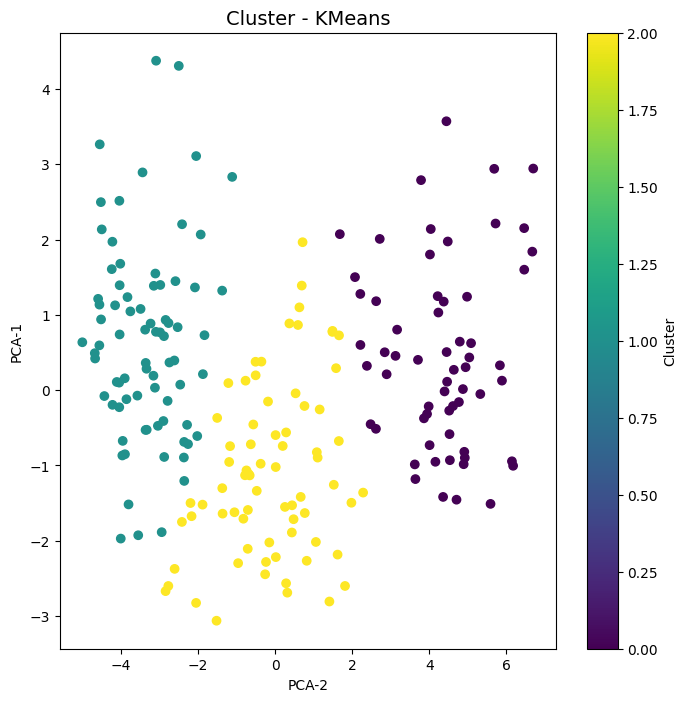

# Projeto: Análise e Agrupamento de Dados de Sementes de Trigo

Este projeto utiliza um conjunto de dados de sementes de trigo para realizar análise de dados, redução de dimensionalidade e agrupamento (clustering) usando o método K-Means. A visualização dos resultados é apresentada através de gráficos de dispersão.

---

## **Estrutura do Projeto**

### **1. Importação das Bibliotecas**
O código utiliza as seguintes bibliotecas:
- `pandas`: Processamento de dados.
- `sklearn.decomposition.PCA`: Redução de dimensionalidade.
- `sklearn.cluster.KMeans`: Algoritmo de agrupamento.
- `matplotlib.pyplot`: Visualização de dados.

### **2. Ingestão dos Dados**
- O conjunto de dados é lido do arquivo `seeds-data.csv`.
- Exibição de uma amostra inicial para verificar a estrutura e os valores presentes.

### **3. Pré-Processamento**
- Remoção de valores ausentes para garantir a qualidade dos dados.
- Cálculo do percentual de remoção dos dados inválidos (neste caso, nenhum valor foi removido).
- Verificação dos tipos de dados.

### **4. Redução de Dimensionalidade**
- Foi aplicada a Análise de Componentes Principais (PCA) para reduzir as variáveis do conjunto de dados de 7 para 2 dimensões principais.
- Isso facilita a visualização e análise dos clusters.

### **5. Agrupamento de Dados**
- O algoritmo K-Means foi utilizado para agrupar os dados em 3 clusters distintos.
- A coluna `Cluster` foi adicionada ao conjunto de dados para identificar a qual grupo cada ponto pertence.

### **6. Visualização**
- Um gráfico de dispersão foi gerado para visualizar os clusters em um espaço bidimensional (PCA-1 e PCA-2).
- As cores representam os diferentes clusters gerados pelo K-Means.

---

## **Gráfico de Clusters**


- **Eixo X:** PCA-1 (Componente Principal 1).
- **Eixo Y:** PCA-2 (Componente Principal 2).
- **Cores:** Identificam os clusters criados pelo algoritmo K-Means.

---

## **Como Executar o Código**
1. Certifique-se de ter as bibliotecas instaladas:
   ```bash
   pip install pandas scikit-learn matplotlib
